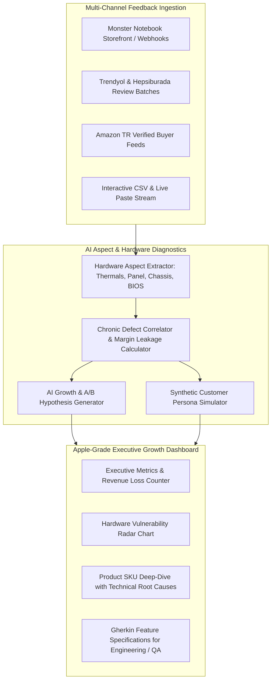

# E-Commerce Growth & Review Intelligence Engine

> **AI-Powered Customer Feedback Diagnostics, Hardware Chronic Defect Discovery & Growth Lab**
> *Turn customer reviews, return logs, and sentiment signals into high-impact A/B test hypotheses, Gherkin specs, and preserved profit margin.*
> *Optimized for high-performance hardware, gaming laptops, curved monitors, desktop rigs & tech accessories (Monster Notebook Ecosystem).*

[](https://nextjs.org/)
[](https://react.dev/)
[](https://www.typescriptlang.org/)
[](https://tailwindcss.com/)
[](https://www.prisma.io/)
[](https://vitest.dev/)
[](https://apple.com)
[](LICENSE)

---

## 🎯 Problem & Purpose

High-performance e-commerce and consumer electronics brands lose millions each year to **unexplained customer returns, thermal throttling complaints, silent panel defects (IPS glow/dead pixels), and kitting/packaging transit damage**.

- **Traditional Analytics:** Only report *that* a return happened (e.g. "Tulpar Laptop return rate is 18.2%").
- **Manual Review Reading:** Impossible to scale across Monster Web, Trendyol, Hepsiburada, and Amazon.
- **The Solution:** The **E-Commerce Growth & Review Intelligence Engine** continuously ingests multi-channel reviews and return records, uses advanced LLMs to extract aspect-level sentiments, calculates dollar revenue leakage, and automatically formulates actionable A/B test hypotheses with developer-ready Gherkin specifications.

---

## 🧠 System Architecture



---

## 🚀 Key Features

### 1. Hardware & Tech Aspect-Based Sentiment Extraction (ABSA)
Categorizes raw customer feedback across critical engineering & operational dimensions:
- **🔥 Thermals & Acoustic (Isınma / Fan Gürültüsü):** Flags 96°C CPU throttling, aggressive 58dB fan curves, and keyboard surface heat.
- **🖥️ Display & Panel Quality (Ekran / IPS Glow / Piksel):** Detects dark-scene yellow corner glow, sub-pixel defects, and 165Hz flicker.
- **🛠️ Chassis & Mechanical Durability (Kasa / Menteşe):** Identifies hinge stiffness, frame flex, and keycap stabilizer rattle.
- **💻 Software & Firmware (BIOS / Drivers / MUX Switch):** Tracks MUX switch BSODs, Control Center crashes, and XMP disabled profiles.
- **⚡ Power & Battery (Güç / Adaptör / Pil):** Analyzes heavy 280W brick weight, rapid battery depletion, and high-load heat.
- **🛡️ After-Sales Service (Ömür Boyu Bakım / Garanti):** Measures thermal paste renewal satisfaction and warranty turnaround times.

### 2. Revenue Leakage & Return Waste Estimator
Computes estimated monthly margin loss per SKU based on:
$$\text{Monthly Loss} = (\text{Monthly Sales} \times \text{Return Rate}) \times (\text{Return Shipping Cost} + \text{Service Triage Fee} + \text{Product Margin})$$

### 3. Apple-Grade Minimalist Aesthetic
- Crafted in deep obsidian space tones (`#06080d`).
- Frosted glassmorphism (`backdrop-blur-2xl`), ultra-fine translucent borders (`border-white/[0.08]`), and tactile micro-interactions.
- Ambient radial glows and clean Apple Health/Watch telemetric data cards.

### 4. AI Growth Lab & A/B Test Hypotheses
Transforms customer complaints into structured product experiments:
- **Problem Statement:** Exact quantification of hardware return driver.
- **Hypothesis:** Specific PDP acoustic simulator, zero-dead-pixel warranty badge, or transit foam packaging tweak.
- **Expected Metric Impact:** Target return reduction and preserved margin.
- **Gherkin User Story:** Ready-to-implement `Given-When-Then` acceptance criteria for engineering and QA teams.

### 5. Synthetic Customer Persona Simulator
Allows PMs, Product Owners, and Engineers to interview synthetic representations of disappointed returners (e.g. *Arda K.*, an esports gamer whose laptop fan was too loud for midnight gaming) to validate copy tweaks, Control Center guides, or packaging inserts before deployment.

---

## 🛠️ Tech Stack

- **Framework:** [Next.js 15](https://nextjs.org/) (App Router, Server Components)
- **Language:** [TypeScript 5.7](https://www.typescriptlang.org/)
- **Design & Styling:** [Tailwind CSS](https://tailwindcss.com/) & [Lucide React](https://lucide.dev/) (Apple Minimalist Dark Aesthetic)
- **Data Visualization:** [Recharts](https://recharts.org/)
- **Database & ORM:** [Prisma](https://www.prisma.io/) with SQLite (zero-config, portable)
- **Testing:** [Vitest](https://vitest.dev/) (unit & integration) & [Playwright](https://playwright.dev/) (E2E)
- **AI Integrations:** Google GenAI SDK (`@google/genai`), OpenAI SDK, Local Heuristic Engine

---

## 📦 Quick Start & Installation

### Prerequisites
- Node.js 18+ or 20+
- npm or pnpm

### 1. Clone & Install
```bash
git clone https://github.com/Tngc93/ecommerce-growth-intelligence-engine.git
cd "ecommerce-growth-intelligence-engine"
npm install
```

### 2. Database Setup & Seeding
```bash
npm run db:push
npm run db:seed
```

### 3. Launch Development Server
```bash
npm run dev
```
Open [http://localhost:3000](http://localhost:3000) to view the Apple-grade Executive Growth Dashboard.

---

## 🧪 Testing Suite

### Unit & Integration Tests (Vitest)
```bash
npm run test
```
Validates hardware aspect extraction, thermal defect classification, and hypothesis generators.

---

## 📄 License
This project is open-source under the [MIT License](LICENSE).
Created with passion by **[Berk_ (Tngc93)](https://github.com/Tngc93)**.
