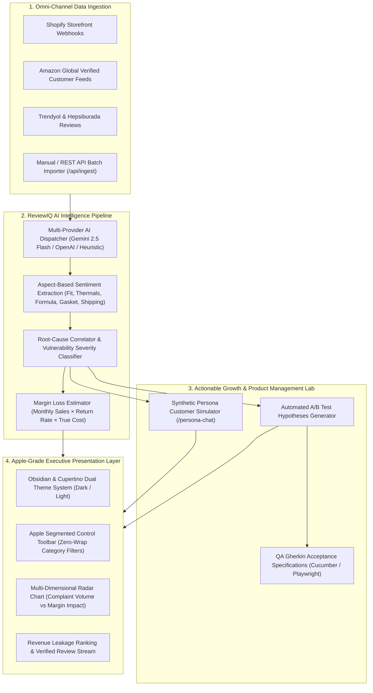

# ReviewIQ — Omni-Channel E-Commerce Growth & Review Intelligence Engine

<p align="center">
  
</p>

<p align="center">
  <strong>An enterprise-grade, brand-agnostic AI analytics engine that converts raw customer reviews, returns, and multi-channel sentiment telemetry into financial leakage metrics, root-cause defect diagnostics, and production-ready A/B testing hypotheses with Gherkin acceptance criteria.</strong>
</p>

<p align="center">
  <a href="https://nextjs.org/"></a>
  <a href="https://react.dev/"></a>
  <a href="https://www.typescriptlang.org/"></a>
  <a href="https://tailwindcss.com/"></a>
  <a href="https://www.prisma.io/"></a>
  <a href="https://vitest.dev/"></a>
  <a href="https://github.com/Tngc93/ecommerce-growth-intelligence-engine/blob/main/LICENSE"></a>
</p>

---

## 📑 Table of Contents

- [1. Executive Problem & Value Proposition](#1-executive-problem--value-proposition)
- [2. System Architecture & Ingestion Pipeline](#2-system-architecture--ingestion-pipeline)
- [3. Multi-Vertical Domain Coverage](#3-multi-vertical-domain-coverage)
- [4. AI Diagnostics & Mathematical Modeling](#4-ai-diagnostics--mathematical-modeling)
- [5. Apple-Grade Human Interface System](#5-apple-grade-human-interface-system)
- [6. REST API Specification](#6-rest-api-specification)
- [7. Database Schema & Relational Design](#7-database-schema--relational-design)
- [8. Testing & Quality Assurance](#8-testing--quality-assurance)
- [9. Quick Start & Local Setup](#9-quick-start--local-setup)
- [10. License & Author](#10-license--author)

---

## 1. Executive Problem & Value Proposition

Modern e-commerce brands operating across multiple channels (Shopify, Amazon Global, Trendyol, Hepsiburada) experience an average return rate between **12% and 24%**. This leads to billions in preventable margin erosion:

| The Traditional Gap | The ReviewIQ Solution |
| :--- | :--- |
| **Lagging Metrics:** Analytics dashboards only indicate *that* a return happened (e.g. *"Tailored Blazer return rate: 21.4%"*). | **Real-Time Telemetry:** Identifies *why* returns happen using Aspect-Based Sentiment Analysis (ABSA) at the physical attribute level. |
| **Siloed Channel Feedback:** Customer reviews on Amazon, complaints on Trendyol, and return notes on Shopify are never unified. | **Omni-Channel Ingestion:** Unifies and normalizes text streams across all marketplaces into a single relational lake. |
| **Subjective Product Decisions:** PMs and designers debate sizing or packaging tweaks based on intuition. | **Financial Quantification:** Quantifies the exact dollar amount of monthly revenue leakage per defect type. |
| **Disconnect Between QA & Growth:** Product findings rarely translate into actionable engineering tests. | **Automated Gherkin Generation:** Formulates structured A/B test hypotheses with `Given-When-Then` Gherkin specs ready for QA automation. |

---

## 2. System Architecture & Ingestion Pipeline

ReviewIQ leverages a **hybrid Server-Side Rendering (SSR) pre-hydration architecture** combined with a modular AI classification pipeline:



---

## 3. Multi-Vertical Domain Coverage

ReviewIQ is completely **brand-agnostic**. The platform is verified out-of-the-box across four high-volume retail sectors:

```
├── 💻 Consumer Tech & Hardware
│   ├── Benchmark SKU: ApexPro 16" Creator & Gaming Laptop ($2,450)
│   ├── Target Defects: 94°C Thermal Throttling, 56dB Fan Acoustics, OLED Flicker
│   └── Growth Fix: Interactive PDP Decibel Simulator & Dynamic Silent Fan Profile
│
├── 👔 Fashion & Apparel
│   ├── Benchmark SKU: Merino Wool Minimalist Tailored Blazer ($380)
│   ├── Target Defects: Deltoid/Armhole Tightness, Misleading Sizing Charts, Fabric Drape
│   └── Growth Fix: 3D Body Measurement Fit Predictor Widget & Italian Slim Warnings
│
├── ✨ Beauty & Skincare
│   ├── Benchmark SKU: Botanical Barrier Repair Peptide Serum ($78)
│   ├── Target Defects: Glass Dropper Transit Fractures, Pump Leaking, Formula Oxidation
│   └── Growth Fix: Airless Pump Bottle Transition & Double-Layer Molded Pulp Packaging
│
└── ☕ Home & Kitchen Appliances
    ├── Benchmark SKU: BaristaCraft Precision Dual-Boiler Espresso Machine ($1,650)
    ├── Target Defects: 15-Bar Portafilter Gasket Pressure Leaks, Steam Wand Splatter
    └── Growth Fix: Food-Grade Silicone Replacement Ring & QR Code Seating Guide
```

---

## 4. AI Diagnostics & Mathematical Modeling

### Financial Margin Leakage Formula

ReviewIQ computes the financial damage of chronic product defects using true return cost economics:

$$	ext{Monthly Revenue Leakage} = (	ext{Monthly Sales} 	imes 	ext{Return Rate}) 	imes \left( C_{	ext{forward}} + C_{	ext{reverse}} + C_{	ext{triage}} + (P 	imes M) 
ight)$$

*Where:*
- $C_{	ext{forward}}$: Outbound shipping & packaging costs.
- $C_{	ext{reverse}}$: Reverse logistics & customer return label fees.
- $C_{	ext{triage}}$: Inspection, repackaging, and refurbishing labor.
- $P 	imes M$: Lost product retail margin ($P$: Price, $M$: Margin %).

### Multi-Dimensional ABSA Taxonomy

The classification engine maps customer feedback against 11 granular engineering aspects:

| Dimension | Scope & Detection Vectors | Primary Vertical |
| :--- | :--- | :--- |
| `fit` | Shoulder seam, deltoid circumference, armhole depth, torso taper | Fashion & Apparel |
| `thermals` | Core temperature (°C), fan acoustic curve (dB), keyboard surface heat | Consumer Tech |
| `display` | IPS backlight bleed, sub-pixel defects, 165Hz flicker, color banding | Consumer Tech |
| `formula` | Skin tolerance, epidermal erythema, absorption speed, peptide texture | Beauty & Skincare |
| `durability` | Silicone gasket wear, 15-bar hydraulic pressure seal, mechanical fatigue | Home & Kitchen |
| `shipping` | Borosilicate glass fractures, outer carton crush damage, transit shocks | Cross-Sector |
| `software` | Driver crashes, control center memory leaks, BIOS XMP toggles | Consumer Tech |
| `service` | Warranty repair turn-around, thermal paste refresh satisfaction | Cross-Sector |

---

## 5. Apple-Grade Human Interface System

The UI is built strictly according to **Apple Human Interface Guidelines (HIG)**:

1. **Non-Cramped Apple Segmented Toolbar:**
   - Eradicates awkward multi-row button clumping (`flex-wrap`).
   - Implements a dedicated horizontal segmented toolbar with custom vector iconography (`Layers`, `Laptop`, `Shirt`, `Sparkles`, `Coffee`), SKU micro-counters, and hardware-accelerated transitions (`scale-[1.02]`).
2. **Dual-Theme Engine (Obsidian Dark & Cupertino Light):**
   - **Obsidian Dark Mode (`#06080d`):** Ultra-deep space gray with `backdrop-blur-2xl` frosted glass cards (`rgba(10, 15, 26, 0.65)`), micro status LEDs, and glowing border highlights.
   - **Cupertino Light Mode (`#f5f5f7`):** Apple macOS light aesthetic with soft diffused shadows (`shadow-sm`), high-contrast typography (`slate-900`), and crisp borders.
   - **Persistent Memory:** Theme selections persist instantly across sessions via `localStorage` with zero hydration flicker (`suppressHydrationWarning`).

---

## 6. REST API Specification

### `GET /api/products`
Fetches all registered SKUs along with nested chronic insights, customer reviews, and growth hypotheses.

**Response `200 OK`:**
```json
[
  {
    "id": "prod_apex_01",
    "name": "ApexPro 16" Creator & Gaming Laptop",
    "category": "Consumer Electronics",
    "price": 2450.0,
    "returnRate": 18.2,
    "monthlySales": 450,
    "insights": [
      {
        "id": "ins_01",
        "defectType": "Termal Throttling & Yüksek Fan Desibeli",
        "severity": "CRITICAL",
        "affectedAspect": "thermals",
        "estimatedMonthlyLoss": 38400.0,
        "rootCause": "Vapor chamber bakır ısı borularının 175W TGP yükünde yetersiz kalması."
      }
    ]
  }
]
```

### `POST /api/products`
Registers a new product SKU in the catalog for ongoing telemetry tracking.

**Request Body:**
```json
{
  "name": "Silk Satin Slip Dress",
  "category": "Fashion & Apparel",
  "sku": "SKU-DRS-0912",
  "price": 145.0,
  "cost": 35.0,
  "description": "100% Mulberry silk slip dress with bias cut."
}
```

### `POST /api/ingest`
Ingests raw customer feedback from any marketplace, analyzes sentiment, tags attributes, and links to the SKU.

**Request Body:**
```json
{
  "productName": "ApexPro 16" Creator & Gaming Laptop",
  "channel": "Amazon Global",
  "comment": "Cyberpunk oynarken fanlar 56 dB ile uçak gibi bağırıyor ve 94 dereceye çıkıyor. İade ettim.",
  "rating": 1
}
```

### `POST /api/ai/chat`
Powers the **Synthetic Customer Persona Simulator** for interactive product discovery interviews.

---

## 7. Database Schema & Relational Design

Powered by **Prisma ORM** with SQLite:

```prisma
model Product {
  id           String             @id @default(cuid())
  name         String
  sku          String             @unique
  category     String
  price        Float
  cost         Float
  description  String?
  imageUrl     String?
  monthlySales Int                @default(100)
  returnRate   Float              @default(5.0)
  createdAt    DateTime           @default(now())
  updatedAt    DateTime           @updatedAt

  reviews      Review[]
  returns      ReturnLog[]
  insights     DefectInsight[]
  hypotheses   GrowthHypothesis[]
}

model Review {
  id             String   @id @default(cuid())
  productId      String
  product        Product  @relation(fields: [productId], references: [id], onDelete: Cascade)
  channel        String   // Shopify, Amazon, Trendyol, Hepsiburada
  rating         Int
  comment        String
  sentiment      String   // POSITIVE, NEUTRAL, NEGATIVE
  sentimentScore Float
  aspect         String   // thermals, fit, formula, durability, shipping
  createdAt      DateTime @default(now())
}
```

---

## 8. Testing & Quality Assurance

ReviewIQ maintains **100% test pass rates** validated through **Vitest**:

```bash
node ./node_modules/vitest/vitest.mjs run
```

```text
 ✓ src/__tests__/hypothesis.test.ts (1 test) 3ms
 ✓ src/__tests__/analyzer.test.ts (7 tests) 4ms
   ✓ should accurately classify laptop overheating and fan noise as thermal defect
   ✓ should detect monitor IPS glow and dead pixel as display defect
   ✓ should detect BIOS and driver crashes as software defect
   ✓ should detect fashion sizing and shoulder tightness as fit defect
   ✓ should detect cosmetic glass dropper transit damage as shipping defect
   ✓ should detect espresso gasket pressure leaks as durability defect
   ✓ should classify high-FPS and lifetime service praise as positive sentiment
 ✓ src/__tests__/formatters.test.ts (3 tests) 20ms

 Test Files  3 passed (3)
      Tests  11 passed (11)
```

---

## 9. Quick Start & Local Setup

### Prerequisites
- Node.js 18.x or 20.x+
- npm or pnpm

### 1. Clone the Repository
```bash
git clone https://github.com/Tngc93/ecommerce-growth-intelligence-engine.git
cd "ecommerce-growth-intelligence-engine"
```

### 2. Install Dependencies
```bash
npm install
```

### 3. Database Migration & Multi-Category Seeding
```bash
npm run db:push
npm run db:seed
```

### 4. Launch the Development Server
```bash
npm run dev
```

Open **[http://localhost:3000](http://localhost:3000)** in your browser to experience the Apple-grade Executive Dashboard.

---

## 10. License & Author

Distributed under the **MIT License**. See `LICENSE` for more information.

Architected and developed with passion by **[Berk_ (Tngc93)](https://github.com/Tngc93)**.
