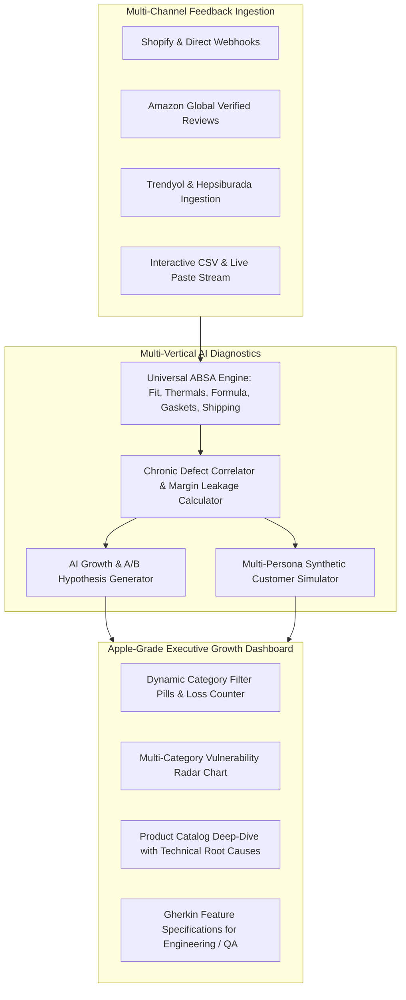

# ReviewIQ — E-Commerce Growth & Review Intelligence Engine

> **Universal AI-Powered Customer Feedback Diagnostics, Multi-Category Chronic Defect Discovery & Growth Lab**
> *Turn customer reviews, return logs, and sentiment signals into high-impact A/B test hypotheses, Gherkin specs, and preserved profit margin across any e-commerce vertical.*

[](https://nextjs.org/)
[](https://react.dev/)
[](https://www.typescriptlang.org/)
[](https://tailwindcss.com/)
[](https://www.prisma.io/)
[](https://vitest.dev/)
[](https://apple.com)
[](LICENSE)

---

## 🎯 Problem & Purpose

Modern brands across all sectors lose millions each year to **unexplained customer returns, fit/sizing mismatches, packaging transit leaks, thermal throttling, and gasket pressure issues**:

- **Traditional Analytics:** Only report *that* a return occurred (e.g. "Tailored Blazer return rate is 21.4%").
- **Manual Review Reading:** Impossible to scale across Shopify, Amazon, Trendyol, and Hepsiburada.
- **The Solution:** The **ReviewIQ Engine** continuously ingests multi-channel feedback, applies multi-dimensional Aspect-Based Sentiment Analysis (ABSA), calculates dollar revenue leakage, and automatically formulates actionable A/B test hypotheses with developer-ready Gherkin specifications.

---

## 🏬 Supported Multi-Category Verticals

| Vertical | Benchmark Defect Focus | Example SKU | AI Diagnostic |
| :--- | :--- | :--- | :--- |
| **💻 Consumer Tech** | Thermals, Fan Acoustics, OLED Flicker | *ApexPro 16" Gaming Laptop* | 94°C Throttling & 56dB Fan Curve |
| **👔 Fashion & Apparel** | Sizing Charts, Shoulder Fit, Fabric Flex | *Merino Wool Tailored Blazer* | Tight Deltoid Cut & Sizing Discrepancy |
| **✨ Beauty & Skincare** | Transit Leaks, Fragile Glass Dropper, Irritation | *Barrier Repair Peptide Serum* | Unpadded Dropper Neck Shearing |
| **☕ Home & Kitchen** | Gasket Pressure Leaks, Steam Wand Splatter | *BaristaCraft Espresso Machine* | Portafilter 54mm Silicone Gasket Degradation |

---

## 🧠 System Architecture



---

## 🚀 Key Features

### 1. Multi-Vertical Aspect-Based Sentiment Analysis (ABSA)
Extracts actionable signals across distinct industry dimensions:
- **Kalıp & Beden (Fit):** Deltoid/shoulder tightness, armhole circumference, torso drape.
- **Termal & Akustik (Thermals):** CPU throttling above 90°C, high-decibel fan curves.
- **Ambalaj & Kargo (Shipping):** Glass dropper breakage, transit shocks, pump leaks.
- **Mekanik & Donanım (Hardware):** Silicone gasket wear, portafilter pressure seals.
- **Formül & İçerik (Formula):** Texture, scent, skin absorption, and sensitivity.

### 2. Revenue Leakage & Return Waste Estimator
Computes estimated monthly margin loss per SKU based on:
$$\\text{Monthly Loss} = (\\text{Monthly Sales} \\times \\text{Return Rate}) \\times (\\text{Return Shipping Cost} + \\text{Triage Fee} + \\text{Product Margin})$$

### 3. Apple-Grade Minimalist Aesthetic
- Crafted in deep obsidian space tones (`#06080d`).
- Frosted glassmorphism (`backdrop-blur-2xl`), ultra-fine translucent borders (`border-white/[0.08]`), and tactile micro-interactions.
- Category filter pills with dynamic instant client-side radar recalibration.

### 4. AI Growth Lab & A/B Test Hypotheses
Transforms customer complaints into structured product experiments:
- **Problem Statement:** Exact quantification of return driver.
- **Hypothesis:** Specific PDP interactive 3D model, fit widget, packaging insert, or firmware tweak.
- **Expected Metric Impact:** Target return reduction and preserved margin.
- **Gherkin User Story:** Ready-to-implement `Given-When-Then` acceptance criteria for engineering and QA teams.

### 5. Multi-Persona Synthetic Customer Simulator
Allows Product Managers and Designers to interview synthetic representations of disappointed returners across all verticals:
- **Caner T.** (Esports Pro / Tech Enthusiast) — Thermals & fan noise.
- **Selin A.** (Architect & Minimalist Fashion Buyer) — Blazer shoulder tightness.
- **Melis D.** (Skincare Enthusiast) — Broken serum dropper & packaging leak.
- **Emre K.** (Home Barista) — Espresso gasket pressure leak.

---

## 🛠️ Tech Stack

- **Framework:** [Next.js 15](https://nextjs.org/) (App Router, Server Components)
- **Language:** [TypeScript 5.7](https://www.typescriptlang.org/)
- **Design & Styling:** [Tailwind CSS](https://tailwindcss.com/) & [Lucide React](https://lucide.dev/) (Apple Minimalist Dark Aesthetic)
- **Data Visualization:** [Recharts](https://recharts.org/)
- **Database & ORM:** [Prisma](https://www.prisma.io/) with SQLite (zero-config, portable)
- **Testing:** [Vitest](https://vitest.dev/) (unit & integration) & [Playwright](https://playwright.dev/) (E2E)
- **AI Integrations:** Google GenAI SDK (`@google/genai`), OpenAI SDK, Local Heuristic Engine

---

## 📦 Quick Start & Installation

### Prerequisites
- Node.js 18+ or 20+
- npm or pnpm

### 1. Clone & Install
```bash
git clone https://github.com/Tngc93/ecommerce-growth-intelligence-engine.git
cd "ecommerce-growth-intelligence-engine"
npm install
```

### 2. Database Setup & Seeding
```bash
npm run db:push
npm run db:seed
```

### 3. Launch Development Server
```bash
npm run dev
```
Open [http://localhost:3000](http://localhost:3000) to view the Apple-grade Executive Growth Dashboard.

---

## 🧪 Testing Suite

### Unit & Integration Tests (Vitest)
```bash
npm run test
```
Validates multi-category aspect extraction, defect classification, and hypothesis generators.

---

## 📄 License
This project is open-source under the [MIT License](LICENSE).
Created with passion by **[Berk_ (Tngc93)](https://github.com/Tngc93)**.
