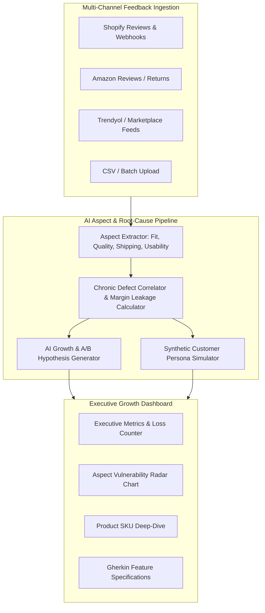

# E-Commerce Growth & Review Intelligence Engine

> **AI-Powered Customer Feedback Diagnostics, Chronic Defect Discovery, and PM Growth Hypotheses**
> *Turn multi-channel customer reviews, return logs, and sentiment signals into high-impact A/B tests and recovered margin.*

[](https://nextjs.org/)
[](https://react.dev/)
[](https://www.typescriptlang.org/)
[](https://tailwindcss.com/)
[](https://www.prisma.io/)
[](https://vitest.dev/)
[](https://playwright.dev/)
[](LICENSE)

---

## 🎯 Problem & Purpose

E-commerce brands and Product Managers lose millions each year to **unexplained customer returns, silent product defects, and misleading size/usage guides**.

- **Traditional Analytics:** Only report *that* a return happened (e.g. "Return rate is 23%").
- **Manual Review Reading:** Impossible to scale across Amazon, Shopify, Trendyol, and support tickets.
- **The Solution:** The **E-Commerce Growth & Review Intelligence Engine** continuously ingests multi-channel reviews and return records, uses advanced LLMs to extract aspect-level sentiments, calculates dollar revenue leakage, and automatically formulates actionable A/B test hypotheses with developer-ready Gherkin specifications.

---

## 🧠 System Architecture



---

## 🚀 Key Features

### 1. Aspect-Based Sentiment Extraction (ABSA)
Categorizes raw customer sentiment across 6 critical operational dimensions:
- **Fit & Sizing:** Detects chest/waist taper miscalibration and size-guide discrepancies.
- **Quality & Durability:** Identifies stitching failures, firmware battery drains, and shrinkage.
- **Shipping & Transit:** Flags glass dropper shatter, container leakage, and packaging impact.
- **Usability & Instructions:** Identifies setup confusion and connectivity drops.
- **Price / Value:** Analyzes price-to-quality perception and willingness to pay.
- **Customer Service:** Tracks resolution speed and return friction.

### 2. Revenue Leakage & Return Waste Estimator
Computes estimated monthly and annual margin loss per SKU based on:
$$\text{Monthly Loss} = (\text{Monthly Sales} \times \text{Return Rate}) \times (\text{Return Shipping Cost} + \text{Restocking Fee} + \text{Product Margin})$$

### 3. AI Growth Lab & A/B Test Hypotheses
Transforms customer complaints into structured product experiments:
- **Problem Statement:** Exact quantification of return driver.
- **Hypothesis:** Specific PDP copy, UX badge, or packaging modification.
- **Expected Metric Impact:** Target return reduction and margin preservation.
- **Gherkin User Story:** Ready-to-implement `Given-When-Then` acceptance criteria for engineering and QA teams.

### 4. Synthetic Customer Persona Simulator
Allows Product Managers and Growth Leads to interview synthetic representations of disappointed returners (e.g. *Marcus V.*, *Sarah M.*) to validate copy tweaks, size charts, or onboarding improvements before pushing to production.

### 5. Multi-Provider AI Engine with Zero-Config Local Fallback
- **Local Heuristic Engine:** Out-of-the-box offline evaluation without requiring any API keys or payment methods.
- **Google Gemini 2.5 Flash:** Native multimodal and structured JSON reasoning (`@google/genai`).
- **OpenAI GPT-4o:** Enterprise JSON schema generation.

---

## 🛠️ Tech Stack

- **Framework:** [Next.js 15](https://nextjs.org/) (App Router, Server Components)
- **Language:** [TypeScript 5.7](https://www.typescriptlang.org/)
- **Styling:** [Tailwind CSS](https://tailwindcss.com/) & [Lucide React](https://lucide.dev/)
- **Data Visualization:** [Recharts](https://recharts.org/)
- **Database & ORM:** [Prisma](https://www.prisma.io/) with SQLite (zero-config, portable)
- **Testing:** [Vitest](https://vitest.dev/) (unit & integration) & [Playwright](https://playwright.dev/) (E2E)
- **AI Integrations:** Google GenAI SDK (`@google/genai`), OpenAI SDK

---

## 📦 Quick Start & Installation

### Prerequisites
- Node.js 18+ or 20+
- npm or pnpm

### 1. Clone & Install
```bash
git clone https://github.com/Tngc93/ecommerce-growth-intelligence-engine.git
cd "ecommerce-growth-intelligence-engine"
npm install
```

### 2. Configure Environment (Optional)
```bash
cp .env.example .env
```
*(No API keys required to test! The built-in Heuristic Engine works immediately out of the box).*

### 3. Database Setup & Seeding
```bash
npm run db:push
npm run db:seed
```

### 4. Launch Development Server
```bash
npm run dev
```
Open [http://localhost:3000](http://localhost:3000) to view the Executive Growth Dashboard.

---

## 🧪 Testing Suite

### Unit & Integration Tests (Vitest)
```bash
npm run test
```
Validates aspect extraction, financial loss calculation, and hypothesis generators.

### End-to-End Tests (Playwright)
```bash
npm run test:e2e
```
Verifies critical user flows: executive overview metrics, radar charts, SKU deep-dive, and live persona interviews.

---

## 📄 License
This project is open-source under the [MIT License](LICENSE).
Created with passion by **[Berk_ (Tngc93)](https://github.com/Tngc93)**.
