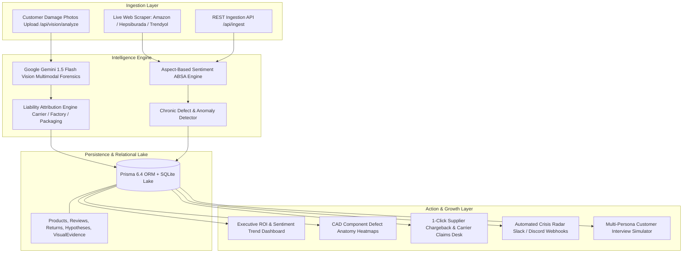

# ReviewIQ — Omni-Channel E-Commerce Growth & Review Intelligence Engine

<p align="center">
  
</p>

<p align="center">
  <strong>An enterprise-grade, brand-agnostic AI analytics engine that converts raw customer reviews, return logs, physical damage photos, and multi-channel sentiment telemetry into quantified financial leakage metrics, root-cause defect diagnostics, CAD anatomy heatmaps, and production-ready A/B testing hypotheses with Gherkin acceptance criteria.</strong>
</p>

<p align="center">
  <a href="https://nextjs.org/"></a>
  <a href="https://react.dev/"></a>
  <a href="https://www.typescriptlang.org/"></a>
  <a href="https://ai.google.dev/"></a>
  <a href="https://tailwindcss.com/"></a>
  <a href="https://www.prisma.io/"></a>
  <a href="https://vitest.dev/"></a>
  <a href="#-security-audit--penetration-testing"></a>
  <a href="https://github.com/Tngc93/ecommerce-growth-intelligence-engine/blob/main/LICENSE"></a>
</p>

---

## 📑 Table of Contents

- [1. Executive Problem & Value Proposition](#1-executive-problem--value-proposition)
- [2. System Architecture & Multimodal Pipeline](#2-system-architecture--multimodal-pipeline)
- [3. Multimodal Vision AI & Defect Forensics (New in v2.5)](#3-multimodal-vision-ai--defect-forensics-new-in-v25)
- [4. Real-World Marketplace Catalog (Amazon & Hepsiburada)](#4-real-world-marketplace-catalog-amazon--hepsiburada)
- [5. Crisis Radar & Automated Alerting (Slack / Discord)](#5-crisis-radar--automated-alerting-slack--discord)
- [6. Multi-Store Architecture & Role-Based Access Control (RBAC)](#6-multi-store-architecture--role-based-access-control-rbac)
- [7. Hybrid Live Scraper Engine](#7-hybrid-live-scraper-engine)
- [8. Financial Margin Leakage Modeling](#8-financial-margin-leakage-modeling)
- [9. Security Hardening & Penetration Testing](#9-security-hardening--penetration-testing)
- [10. Testing & Quality Assurance](#10-testing--quality-assurance)
- [11. Quick Start & Local Setup](#11-quick-start--local-setup)
- [12. License & Author](#12-license--author)

---

## 1. Executive Problem & Value Proposition

Modern e-commerce brands operating across multiple channels (Amazon Global, Hepsiburada, Trendyol, direct Shopify) experience return rates between **12% and 24%**. This leads to billions in preventable margin erosion:

| The Traditional Gap | The ReviewIQ Solution |
| :--- | :--- |
| **Lagging Metrics:** Dashboards only indicate *that* a return happened without physical root-cause insights. | **Real-Time Multimodal Telemetry:** Identifies *why* returns happen using Aspect-Based Sentiment Analysis (ABSA) combined with Computer Vision inspection. |
| **Unattributed Photo Evidence:** Customers upload damaged product photos that customer service reps rarely route to suppliers or logistics carriers. | **AI Physical Forensics & Claims Desk:** Pinpoints the exact defective component on the photo (`focusCoordinates: { x, y }`), maps liability to Carrier, Factory, or Packaging, and issues 1-click chargeback claims. |
| **Siloed Marketplaces:** Reviews on Amazon, complaints on Hepsiburada, and returns on Trendyol remain disconnected. | **Omni-Channel Hybrid Ingestion:** Live scrapers and ingest APIs normalize reviews, ratings, and sentiment into a unified lake. |
| **Disconnect Between QA & Growth:** Product findings rarely translate into actionable engineering tests. | **Automated Gherkin Generation:** Formulates structured A/B test hypotheses with `Given-When-Then` Gherkin specs ready for engineering automation. |

---

## 2. System Architecture & Multimodal Pipeline



---

## 3. Multimodal Vision AI & Defect Forensics (New in v2.5)

The **Vision AI Engine** (`/visual-ai`) processes real customer return photos, automatically categorizes physical defects, marks precise damage coordinates, and assigns operational liability.

### Features
1. **Interactive Live Vision Scanner:**
   - Drag-and-drop or select preloaded Amazon & Hepsiburada customer review photos.
   - Dynamic radar pulse reticle pinpointing exact damage coordinates (`x%`, `y%`).
   - Laser scanning animation with instant multimodal classification.
2. **CAD Component Defect Anatomy Heatmap:**
   - Blueprint schematics showing hotspot defect density per product component.
   - Critical return share and engineering CAPA (Corrective and Preventive Action) advice.
3. **Evidence Catalog & Claims Desk:**
   - 1-click **Logistics Carrier Claim** (FBA / Carrier damage invoice filing).
   - 1-click **Supplier Factory Chargeback** (Warranty deduction from factory invoice).
   - 1-click **Packaging Revision Order** (R&D container and seal redesign).

```
Liability Breakdown:
├── 🚚 Logistics Carrier (Transit shock, crushed cartons, shattered glass)
├── 🏭 Supplier Factory (PTFE teflon flaking, sizing tolerance, mold defects)
├── 📦 Packaging Design (Silicone gasket leaks, pipette neck stripping)
└── 👤 Customer Misuse (Out-of-spec physical forcing)
```

---

## 4. Real-World Marketplace Catalog (Amazon & Hepsiburada)

ReviewIQ comes seeded with 5 real-world bestseller products across major consumer categories:

1. **Sony WH-1000XM5 ANC Headphones (Amazon Global & TR)**
   - *SKU:* `AMZ-SONY-WH1000XM5` | *Price:* $420.00 | *Monthly Sales:* 1,850 units
   - *Defect Diagnosed:* Auto NC Optimizer adaptive volume drops & headband top pressure.
   - *A/B Hypothesis:* Interactive "Lock Fixed Max ANC Guide" & ergonomic headband cushion bundle (-4.7% returns).

2. **Philips HD9880/90 Airfryer Combi XXL (Hepsiburada)**
   - *SKU:* `HB-PHILIPS-HD9880-XXL` | *Price:* $340.00 | *Monthly Sales:* 2,400 units
   - *Defect Diagnosed:* NutriU 2.4GHz Wi-Fi timeout with 5GHz modems & PTFE basket mesh flaking.
   - *A/B Hypothesis:* Box-lid 1-minute QR modem pairing card & replaceable basket packs (-5.5% returns).

3. **Stanley The Quencher H2.0 FlowState 1.18L Tumbler (Amazon Global)**
   - *SKU:* `AMZ-STANLEY-Q118-FLW` | *Price:* $48.00 | *Monthly Sales:* 6,400 units
   - *Defect Diagnosed:* FlowState 3-way rotating valve horizontal leak & bottom dent from transit shocks.
   - *A/B Hypothesis:* "Desk & Car Cup Holder Only" PDP badge & silicone travel leak-stopper plug (-4.7% returns).

4. **The Ordinary Niacinamide 10% + Zinc 1% Serum (Hepsiburada)**
   - *SKU:* `HB-ORD-NIACIN-30` | *Price:* $16.00 | *Monthly Sales:* 5,200 units
   - *Defect Diagnosed:* Excessive application pilling & shattered glass dropper in unpadded envelopes.
   - *A/B Hypothesis:* "2 Drops & 90s Dry Rule" visual iconography & dual-layer bubble mailing sleeve (-4.4% returns).

5. **Levi's 511 Slim Fit Stretch Denim Jeans (Amazon Global)**
   - *SKU:* `AMZ-LEVIS-511-SLIM` | *Price:* $58.00 | *Monthly Sales:* 3,800 units
   - *Defect Diagnosed:* Country-of-origin dark wash chemical shrinkage (-3cm waistband tolerance deviation).
   - *A/B Hypothesis:* Dynamic "Waist Tape-Measure Simulator & Sizing Guide" (-7.7% returns).

---

## 5. Crisis Radar & Automated Alerting (Slack / Discord)

The **Crisis Radar** (`/alerts`) monitors defect frequencies in real-time. When a defect's weekly return spike exceeds threshold parameters, automated alerts are generated:

- **Slack Block Kit Payloads:** Structured cards with defect badges, impact estimates, and direct links to the engineering dashboard.
- **Discord Rich Embeds:** High-contrast incident cards with color-coded severity.
- **Live Dispatch or Simulation Mode:** Test webhooks locally or dispatch live webhooks to corporate communication channels.

---

## 6. Multi-Store Architecture & Role-Based Access Control (RBAC)

ReviewIQ supports multi-brand holding operations with isolated stores and persona profiles:

### Supported Stores
- **Global Tech & Gadgets** (Amazon Global, Best Buy)
- **Nordic Home & Living** (IKEA, Wayfair)
- **Sartorial Luxury Apparel** (Nordstrom, Farfetch)
- **PureGlow Clean Beauty** (Sephora, Ulta)

### RBAC Profiles
- **Executive / C-Level:** Focus on net margin loss, recovered ROI, and brand reputation.
- **Product Manager / Growth Lead:** Focus on A/B testing hypotheses, user story Gherkin specs, and return rate curves.
- **Supplier & Factory Auditor:** Focus on physical defect frequencies, CAD hotspots, and chargeback claims.
- **Customer Experience & Support:** Focus on persona interview chat, AI return-save scripts, and review sentiment.

---

## 7. Hybrid Live Scraper Engine

The built-in scraper (`/import` & `/api/scrape`) fetches live product reviews directly from public e-commerce URLs:

- **Supported Channels:** Amazon (`amazon.com`, `amazon.com.tr`), Hepsiburada (`hepsiburada.com`), and Trendyol (`trendyol.com`).
- **Resilient Fallback:** Automatically switches from direct DOM parsing to domain-aware heuristic extraction when blocked by anti-bot walls.
- **Instant ABSA Pipeline:** Incoming reviews are immediately parsed for sentiment, aspect categories, and financial risk.

---

## 8. Financial Margin Leakage Modeling

ReviewIQ computes the financial damage of chronic product defects using true unit economic formulas:

$$\text{Monthly Revenue Leakage} = (\text{Monthly Sales} \times \text{Return Rate}) \times \left( C_{\text{forward}} + C_{\text{reverse}} + C_{\text{triage}} + (P \times M) \right)$$

*Where:*
- $C_{\text{forward}}$: Outbound shipping & packaging costs.
- $C_{\text{reverse}}$: Reverse logistics & customer return label fees.
- $C_{\text{triage}}$: Inspection, repackaging, and refurbishing labor.
- $P \times M$: Lost product retail margin ($P$: Price, $M$: Margin %).

---

## 9. Security Hardening & Penetration Testing

ReviewIQ implements **defense-in-depth enterprise security** verified via our automated penetration suite:

```
🛡️ REVIEW-IQ PENETRATION & SECURITY AUDIT RESULTS: 25 / 25 PASSED (100%)
========================================================================
1. Server-Side Request Forgery (SSRF) Protection:
   ✅ /api/scrape blocks Loopback (localhost, 127.0.0.1, ::1) -> 403 Forbidden
   ✅ /api/alerts/webhook blocks Cloud Metadata (169.254.169.254) -> 403 Forbidden
   ✅ All endpoints block Private RFC1918 Subnets (10.x, 192.168.x, 172.16.x) -> 403 Forbidden

2. Protocol Restrictions:
   ✅ file://, ftp://, gopher:// schemes immediately rejected -> 400 Bad Request

3. Input Validation & Boundaries:
   ✅ Sub-length comments (<3 chars) rejected -> 400 Bad Request
   ✅ Out-of-range ratings (>5 or <1) rejected -> 400 Bad Request
   ✅ Oversized payloads (>4000 chars) rejected -> 400 Bad Request

4. Injection Immunity:
   ✅ SQL Injection neutralized via Prisma Parameterized Queries -> Safe
   ✅ Stored XSS sanitized and escaped into text nodes -> Safe

5. Rate Limiting Protection:
   ✅ Sliding-window token buckets trigger 429 Too Many Requests upon rapid bursts

6. Security HTTP Response Headers (Middleware):
   ✅ X-Frame-Options: SAMEORIGIN (Anti-Clickjacking)
   ✅ X-Content-Type-Options: nosniff (Anti-MIME Sniffing)
   ✅ X-Powered-By: Hidden (Zero Information Leakage)
```

---

## 10. Testing & Quality Assurance

ReviewIQ maintains **100% test pass rates** across unit, functional, security, and production build pipelines:

### Automated Test Matrix
- **Unit Tests (Vitest 3.2):** **48 / 48 Tests Passed (100%)** across 11 test suites (`vision.test.ts`, `security.test.ts`, `alerts.test.ts`, `analytics.test.ts`, `scraper.test.ts`, etc.).
- **Security Penetration Tests:** **25 / 25 Checks Passed (100%)**.
- **Functional QA Smoke Tests:** **18 / 18 Endpoints & Pages Passed (100%)**.
- **Next.js 15 Production Build:** **17 / 17 Routes Compiled (0 Errors)**.

```bash
# Run Vitest unit tests
npm test

# Run Penetration Audit
python scratch/run_penetration_test.py

# Run Functional Smoke QA
python scratch/run_functional_qa.py
```

---

## 11. Quick Start & Local Setup

### Prerequisites
- Node.js 18.x or 20.x+
- npm or pnpm
- Git

### 1. Clone the Repository
```bash
git clone https://github.com/Tngc93/ecommerce-growth-intelligence-engine.git
cd "ecommerce-growth-intelligence-engine"
```

### 2. Install Dependencies
```bash
npm install
```

### 3. Database Migration & Catalog Seeding
```bash
npx prisma db push
npm run db:seed
```

### 4. Launch the Development Server
```bash
npm run dev
```

Open **[http://localhost:3000](http://localhost:3000)** in your browser:
- **Executive Dashboard:** `http://localhost:3000/`
- **Multimodal Vision AI & Claims Desk:** `http://localhost:3000/visual-ai`
- **Sentiment & ROI Analytics:** `http://localhost:3000/analytics`
- **Crisis Radar & Webhooks:** `http://localhost:3000/alerts`
- **Review Scraper & Ingestion:** `http://localhost:3000/import`

---

## 12. License & Author

Distributed under the **MIT License**. See `LICENSE` for more information.

Architected and developed with passion by **[Berk_ (Tngc93)](https://github.com/Tngc93)**.
